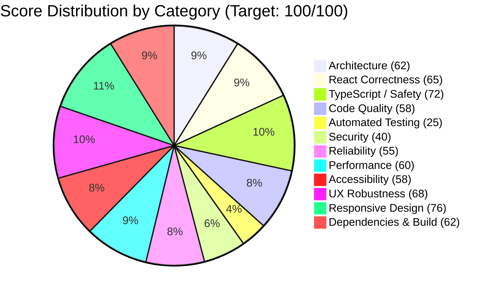
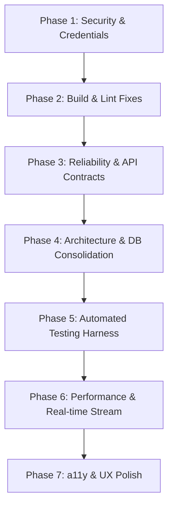

# Production-Readiness Quality Scorecard & Audit Report

**Application:** Fashion Date (Sorteio Provador Fashion 2026)  
**Repository Name:** `site-creator-vinext-starter` / `fashion-date`  
**Audit Date:** August 21, 2026  
**Auditor:** Antigravity AI Code Quality & Production-Readiness Engine  
**Audit Mode:** Read-Only Static & Dynamic Empirical Inspection  
**Deliverable Path:** [`docs/quality-audit/SCORECARD.md`](file:///c:/Users/thomas/OneDrive/Documentos/ChatGPT/Fashion%20Date/docs/quality-audit/SCORECARD.md)

---

## 1. Executive Summary

A comprehensive, evidence-based production-readiness audit was conducted across the entire Fashion Date React codebase. The application is a full-stack event registration, real-time live drawing, and administration platform built for the **Fashion Date Crente Chic 2026** fashion event by Renata Castanheira.

The evaluation analyzed twelve core dimensions independently from **0 to 100**, where 100 represents full objective verification of all production-grade criteria.

### Key Audit Findings:
- **Overall Quality Score:** **58.4 / 100** (Grade: **D+ / Pre-Production**)
- **Strengths:** 
  - Complete Next.js 16 + React 19 + Vinext (Cloudflare Workers / D1) architecture with server-rendering capabilities.
  - Zero TypeScript compilation errors (`npx tsc --noEmit` passes with 0 errors).
  - Production build succeeds (`vinext build` generates client, SSR, and RSC bundles in under 6 seconds).
  - High-fidelity visual styling tailored to the luxury event aesthetic.
  - Native Web Audio API synthesizer for live slot-machine effects with zero external audio assets.
- **Critical Production Blockers:**
  1. **Security & PII Exposure (Critical):** The public endpoint [`app/api/participants/route.ts`](file:///c:/Users/thomas/OneDrive/Documentos/ChatGPT/Fashion%20Date/app/api/participants/route.ts#L3-L38) allows unauthenticated phone number lookups without rate limiting, CAPTCHA, or masking, allowing trivial scraping of all attendee names, stores, WhatsApp numbers, and Instagram handles.
  2. **Hardcoded Secrets & Insecure Auth (Critical):** Fallback admin password `"fashiondate2026"` is hardcoded in [`app/api/_lib/db.ts:11`](file:///c:/Users/thomas/OneDrive/Documentos/ChatGPT/Fashion%20Date/app/api/_lib/db.ts#L11) and exposed in the client-side constant [`constants/config.ts:5`](file:///c:/Users/thomas/OneDrive/Documentos/ChatGPT/Fashion%20Date/constants/config.ts#L5). Admin authorization accepts passwords in GET query parameters (`?key=...`), leaking credentials to browser logs, proxy histories, and HTTP Referers.
  3. **Broken API Endpoints / Dead Contract (High):** [`services/drawService.ts`](file:///c:/Users/thomas/OneDrive/Documentos/ChatGPT/Fashion%20Date/services/drawService.ts#L21) defines `getSettings` (`GET /api/admin/settings`) and `getWinners` (`GET /api/admin/draw`), but neither route defines a `GET` handler, resulting in `405 Method Not Allowed` if called.
  4. **Linting Failure (High):** `npm run lint` fails with 2 blocking errors (`react-hooks/set-state-in-effect` and `jsx-a11y/no-autofocus` in [`components/public/LojistaGateModal.tsx`](file:///c:/Users/thomas/OneDrive/Documentos/ChatGPT/Fashion%20Date/components/public/LojistaGateModal.tsx#L17)).
  5. **Automated Testing Deficit (Critical):** Only 6 basic HTML regex assertions exist in [`tests/rendered-html.test.mjs`](file:///c:/Users/thomas/OneDrive/Documentos/ChatGPT/Fashion%20Date/tests/rendered-html.test.mjs). There are zero unit, integration, hook, or E2E tests.
  6. **Excessive Backend Polling & DDL Overhead (High):** [`hooks/useLiveAlert.ts:97`](file:///c:/Users/thomas/OneDrive/Documentos/ChatGPT/Fashion%20Date/hooks/useLiveAlert.ts#L97) polls `/api/live-draw` every 1,000ms per client without caching or backoff. Each request runs [`initialize()`](file:///c:/Users/thomas/OneDrive/Documentos/ChatGPT/Fashion%20Date/app/api/_lib/db.ts#L4-L10) which executes 6 `CREATE TABLE`/`CREATE INDEX` statements on Cloudflare D1.
  7. **Vulnerable Dependencies (High):** `npm audit` reports 20 vulnerabilities (15 High, 4 Moderate, 1 Low), including remote denial of service and server function risks in `react-server-dom-webpack`, `vite`, `undici`, and `ws`.

---

## 2. Stack Detected

| Component / Layer | Technology Detected | Version / Detail |
| :--- | :--- | :--- |
| **Package Manager** | npm | `11.10.0` (Node `v24.11.1`, engine spec `>=22.13.0`) |
| **UI Library** | React | `19.2.6` (with `@types/react: 19.2.14`, `@types/react-dom: 19.2.3`) |
| **Framework / Runtime** | Next.js App Router + Vinext | Next.js ESLint plugin `16.2.6`, `vinext: 1.0.0-beta.2` |
| **Build Tool** | Vite | `8.0.13` with `@vitejs/plugin-react`, `@vitejs/plugin-rsc` |
| **Target Platform** | Cloudflare Workers + D1 Database | `@cloudflare/vite-plugin: 1.37.1`, `wrangler: 4.92.0` |
| **Language & Transpiler**| TypeScript | `5.9.3` (`strict: true`, `target: ES2017`, `moduleResolution: bundler`) |
| **Styling & Design System**| Tailwind CSS + Vanilla CSS | `@tailwindcss/postcss: 4.2.1`, `app/globals.css` (81KB custom styles) |
| **Database / ORM** | Cloudflare D1 SQLite / Drizzle ORM | `drizzle-orm: 0.45.2`, `drizzle-kit: 0.31.10` (custom raw D1 helper used) |
| **Linting & Code Quality**| ESLint Flat Config | `eslint: 9.39.4`, `typescript-eslint: 8.59.3`, `eslint-plugin-jsx-a11y: 6.10.2` |
| **Testing Engine** | Node Test Runner (`node:test`) | Single integration test file (`tests/rendered-html.test.mjs`) |
| **Sound Engine** | Web Audio API | Zero-dependency procedural synthesizer (`utils/audio.ts`) |

---

## 3. Scorecard by Category



| # | Category | Score (0-100) | Status | Primary Blocking Issue |
| :-: | :--- | :-: | :---: | :--- |
| **1** | Architecture | **62** | ⚠️ Needs Work | Layer boundary inversion; ORM bifurcation; dead code modules |
| **2** | React Correctness & Best Practices | **65** | ⚠️ Needs Work | Synchronous `setState` in effect; unmount leaks in 9s animation; `window.location` reloads |
| **3** | TypeScript / Type Safety | **72** | 🟡 Moderate | Type mismatch for `luckyNumber` (number vs string); unsafe casts & non-null assertions |
| **4** | Code Quality & Maintainability | **58** | ⚠️ Needs Work | ESLint errors; 81KB monolithic CSS; 6 orphaned components |
| **5** | Automated Testing | **25** | 🔴 Critical | Zero unit/integration tests for hooks, services, APIs, and business rules |
| **6** | Security | **40** | 🔴 Critical | Public PII scraping vector; hardcoded admin password; query param auth; 20 CVEs |
| **7** | Runtime Reliability & Error Handling | **55** | ⚠️ Needs Work | Non-existent GET routes in drawService; RNG collision flaw; DDL executed per request |
| **8** | Performance | **60** | ⚠️ Needs Work | Unthrottled 1s polling hammering backend; render-blocking `@import` font; 81KB CSS |
| **9** | Accessibility (WCAG 2.1 AA) | **58** | ⚠️ Needs Work | Modals lack focus traps/Escape handlers; autofocus lint error; gold text contrast failure |
| **10** | UX Robustness | **68** | 🟡 Moderate | Hard page refreshes on navigation; generic error display; unconfirmed deletion undo |
| **11** | Responsive Design | **76** | 🟢 Acceptable | Small touch targets (< 44px) on tables and pagination; mobile card layout overrides |
| **12** | Dependency & Build Health | **62** | ⚠️ Needs Work | 20 npm vulnerabilities (15 high); ESLint CLI failure; npm engine configuration warnings |
| | **OVERALL AVERAGE** | **58.4** | ⚠️ **PRE-PRODUCTION** | **Requires systematic remediation before public launch** |

---

## 4. Exact Scoring Methodology

The evaluation uses a strict deductive scoring model starting at 100 points for each category:
- **Critical Finding (Breach of Security, Complete Test Absence, Hard Crashing Bug):** `-20` to `-30` points.
- **High Finding (Linting Failure, Broken API Route, Race Condition, PII Exposure, Memory Leak):** `-10` to `-19` points.
- **Medium Finding (Dead Code, Inverted Dependency, Missing Focus Trap, Unthrottled Polling, CSS Monolith):** `-5` to `-9` points.
- **Low Finding (Minor Type Inconsistency, Deprecated Config Warning, Touch Target < 44px):** `-1` to `-4` points.

A score of 100 requires that **every single acceptance criterion** is verified with zero outstanding findings.

---

## 5. Detailed Category Analysis & Evidence

### 5.1 Architecture (Score: 62/100)
- **Score Breakdown:** 100 - 15 (Dependency Inversion) - 10 (ORM Bifurcation) - 8 (Dead/Disconnected Modules) - 5 (Per-Request DDL Execution) = **62**
- **Evidence & Findings:**
  1. *[High]* **Inverted Dependency Direction:** Shared components import directly from route implementation folders.
     - [`components/layout/AdminHeader.tsx:1`](file:///c:/Users/thomas/OneDrive/Documentos/ChatGPT/Fashion%20Date/components/layout/AdminHeader.tsx#L1): `import { DrawTransitionLink } from "@/app/admin/draw-transition-link";`
     - [`components/layout/AdminSidebar.tsx:3`](file:///c:/Users/thomas/OneDrive/Documentos/ChatGPT/Fashion%20Date/components/layout/AdminSidebar.tsx#L3): `import { DrawTransitionLink } from "@/app/admin/draw-transition-link";`
     - [`components/admin/WinnersTable.tsx:13`](file:///c:/Users/thomas/OneDrive/Documentos/ChatGPT/Fashion%20Date/components/admin/WinnersTable.tsx#L13): `import { DrawTransitionLink } from "@/app/admin/draw-transition-link";`
     *Impact:* Inverts clean architectural layering where UI components must not depend on application page routes.
  2. *[Medium]* **ORM Bifurcation / Dual Data Layer:** 
     - Drizzle ORM schema and client are configured in [`db/schema.ts`](file:///c:/Users/thomas/OneDrive/Documentos/ChatGPT/Fashion%20Date/db/schema.ts) and [`db/index.ts`](file:///c:/Users/thomas/OneDrive/Documentos/ChatGPT/Fashion%20Date/db/index.ts).
     - However, all API routes bypass `getDb()` and Drizzle entirely, using raw SQL string concatenations and manual mappers via [`app/api/_lib/db.ts`](file:///c:/Users/thomas/OneDrive/Documentos/ChatGPT/Fashion%20Date/app/api/_lib/db.ts).
  3. *[Medium]* **Dead Architecture Modules:**
     - [`app/chatgpt-auth.ts`](file:///c:/Users/thomas/OneDrive/Documentos/ChatGPT/Fashion%20Date/app/chatgpt-auth.ts) implements ChatGPT header-based authentication, but the application uses custom `x-admin-key` authentication, leaving 91 lines of unreferenced auth code.
     - Unused duplicate components: [`components/public/RegistrationForm.tsx`](file:///c:/Users/thomas/OneDrive/Documentos/ChatGPT/Fashion%20Date/components/public/RegistrationForm.tsx), [`components/public/LuckyTicketCard.tsx`](file:///c:/Users/thomas/OneDrive/Documentos/ChatGPT/Fashion%20Date/components/public/LuckyTicketCard.tsx), [`components/admin/DrawWinnerCard.tsx`](file:///c:/Users/thomas/OneDrive/Documentos/ChatGPT/Fashion%20Date/components/admin/DrawWinnerCard.tsx).

---

### 5.2 React Correctness & Best Practices (Score: 65/100)
- **Score Breakdown:** 100 - 12 (Sync setState in effect) - 10 (Unmounted promise leaks) - 8 (Hard reloads via window.location) - 5 (Array index keys) = **65**
- **Evidence & Findings:**
  1. *[High]* **Synchronous `setState` in `useEffect`:**
     - [`components/public/LojistaGateModal.tsx:17`](file:///c:/Users/thomas/OneDrive/Documentos/ChatGPT/Fashion%20Date/components/public/LojistaGateModal.tsx#L17): Calling `setIsOpen(true)` synchronously inside `useEffect` triggers immediate cascading re-renders and causes ESLint rule `react-hooks/set-state-in-effect` to fail.
  2. *[High]* **Unmounted Component Memory Leaks in 9-Second Animation Sequence:**
     - [`hooks/useSlotMachine.ts:50-128`](file:///c:/Users/thomas/OneDrive/Documentos/ChatGPT/Fashion%20Date/hooks/useSlotMachine.ts#L50-L128): Executes a multi-stage suspense sequence across 9+ seconds of chained `await new Promise(r => setTimeout(r, ...))` calls without an `AbortController` or cancellation flag. If the user navigates away or switches tabs during the draw, state setters (`setDigits`, `setWinner`, `setLockedDigits`) fire on an unmounted component.
  3. *[Medium]* **Hard Page Navigation Anti-Pattern:**
     - Client pages frequently call `window.location.assign(...)` instead of framework client-side routing:
       - [`app/page.tsx:84-86`](file:///c:/Users/thomas/OneDrive/Documentos/ChatGPT/Fashion%20Date/app/page.tsx#L84-L86)
       - [`app/page.tsx:100`](file:///c:/Users/thomas/OneDrive/Documentos/ChatGPT/Fashion%20Date/app/page.tsx#L100)
       - [`app/admin/draw-transition-link.tsx:49, 56`](file:///c:/Users/thomas/OneDrive/Documentos/ChatGPT/Fashion%20Date/app/admin/draw-transition-link.tsx#L49-L56)
     *Impact:* Triggers full document unloads, destroys React in-memory state, and eliminates SPA performance benefits.
  4. *[Low]* **Unstable Array Index Keys:**
     - Confetti elements use array index `key={index}` or `key={i}`:
       - [`app/admin/sorteio/page.tsx:75`](file:///c:/Users/thomas/OneDrive/Documentos/ChatGPT/Fashion%20Date/app/admin/sorteio/page.tsx#L75)
       - [`app/live-draw-alert.tsx:84`](file:///c:/Users/thomas/OneDrive/Documentos/ChatGPT/Fashion%20Date/app/live-draw-alert.tsx#L84)
       - [`app/sucesso/page.tsx:34`](file:///c:/Users/thomas/OneDrive/Documentos/ChatGPT/Fashion%20Date/app/sucesso/page.tsx#L34)

---

### 5.3 TypeScript / Type Safety (Score: 72/100)
- **Score Breakdown:** 100 - 10 (Type drift on luckyNumber) - 8 (Unchecked casts & non-null assertions) - 6 (Untrusted API runtime validation) - 4 (Implicit coercion arithmetic) = **72**
- **Evidence & Findings:**
  1. *[High]* **Lucky Number Type Contradiction:**
     - [`types/participant.types.ts:7`](file:///c:/Users/thomas/OneDrive/Documentos/ChatGPT/Fashion%20Date/types/participant.types.ts#L7): `luckyNumber: number;`
     - [`types/draw.types.ts:5`](file:///c:/Users/thomas/OneDrive/Documentos/ChatGPT/Fashion%20Date/types/draw.types.ts#L5): `luckyNumber: number;`
     - [`app/api/_lib/db.ts:2`](file:///c:/Users/thomas/OneDrive/Documentos/ChatGPT/Fashion%20Date/app/api/_lib/db.ts#L2): `luckyNumber: string;` (database column `lucky_number TEXT NOT NULL UNIQUE`)
     - [`app/live-draw-alert.tsx:7`](file:///c:/Users/thomas/OneDrive/Documentos/ChatGPT/Fashion%20Date/app/live-draw-alert.tsx#L7): `luckyNumber?: string;`
     *Impact:* Requires repeated `String(num)` and `Number(str)` conversions across components and creates subtle bugs in comparisons and sorting.
  2. *[Medium]* **Unsafe Non-Null Assertion and Unchecked Casts:**
     - [`app/api/participants/route.ts:108`](file:///c:/Users/thomas/OneDrive/Documentos/ChatGPT/Fashion%20Date/app/api/participants/route.ts#L108): `participant: row(inserted!)` forcefully asserts `inserted` is non-null.
     - [`app/api/_lib/db.ts:11`](file:///c:/Users/thomas/OneDrive/Documentos/ChatGPT/Fashion%20Date/app/api/_lib/db.ts#L11): `(env as unknown as {ADMIN_PASSWORD?:string}).ADMIN_PASSWORD` double-cast bypasses Cloudflare Worker environment typing.
  3. *[Medium]* **Untrusted Runtime Data Without Schema Validation:**
     - API request bodies in [`app/api/admin/participants/route.ts:13`](file:///c:/Users/thomas/OneDrive/Documentos/ChatGPT/Fashion%20Date/app/api/admin/participants/route.ts#L13) and [`app/api/participants/route.ts:42`](file:///c:/Users/thomas/OneDrive/Documentos/ChatGPT/Fashion%20Date/app/api/participants/route.ts#L42) use `as Record<string, unknown>` without validation using schema parsers like Zod or Valibot.

---

### 5.4 Code Quality & Maintainability (Score: 58/100)
- **Score Breakdown:** 100 - 15 (ESLint command failure) - 12 (Monolithic CSS) - 10 (Dead code components) - 5 (Duplicated fetch logic) = **58**
- **Evidence & Findings:**
  1. *[High]* **ESLint Build Verification Failure:**
     - Execution of `npm run lint` failed with exit code `1`:
       - `components/public/LojistaGateModal.tsx:17:7` - `react-hooks/set-state-in-effect`
       - `components/public/LojistaGateModal.tsx:72:17` - `jsx-a11y/no-autofocus`
  2. *[High]* **81KB Monolithic CSS File:**
     - [`app/globals.css`](file:///c:/Users/thomas/OneDrive/Documentos/ChatGPT/Fashion%20Date/app/globals.css) contains 359 minified, dense lines (81,196 bytes) containing redundant class definitions:
       - `.draw-page` is declared 4 separate times ([L8](file:///c:/Users/thomas/OneDrive/Documentos/ChatGPT/Fashion%20Date/app/globals.css#L8), [L9](file:///c:/Users/thomas/OneDrive/Documentos/ChatGPT/Fashion%20Date/app/globals.css#L9), [L112](file:///c:/Users/thomas/OneDrive/Documentos/ChatGPT/Fashion%20Date/app/globals.css#L112), [L114](file:///c:/Users/thomas/OneDrive/Documentos/ChatGPT/Fashion%20Date/app/globals.css#L114)).
       - `.stitch-button` is declared multiple times ([L69](file:///c:/Users/thomas/OneDrive/Documentos/ChatGPT/Fashion%20Date/app/globals.css#L69), [L110](file:///c:/Users/thomas/OneDrive/Documentos/ChatGPT/Fashion%20Date/app/globals.css#L110)).
       - `.live-winner-overlay` is declared 4 separate times ([L296](file:///c:/Users/thomas/OneDrive/Documentos/ChatGPT/Fashion%20Date/app/globals.css#L296), [L299](file:///c:/Users/thomas/OneDrive/Documentos/ChatGPT/Fashion%20Date/app/globals.css#L299), [L301](file:///c:/Users/thomas/OneDrive/Documentos/ChatGPT/Fashion%20Date/app/globals.css#L301), [L303](file:///c:/Users/thomas/OneDrive/Documentos/ChatGPT/Fashion%20Date/app/globals.css#L303)).
  3. *[Medium]* **Dead Code / Orphaned Files:**
     - [`components/public/RegistrationForm.tsx`](file:///c:/Users/thomas/OneDrive/Documentos/ChatGPT/Fashion%20Date/components/public/RegistrationForm.tsx) (190 lines - unused)
     - [`components/public/LuckyTicketCard.tsx`](file:///c:/Users/thomas/OneDrive/Documentos/ChatGPT/Fashion%20Date/components/public/LuckyTicketCard.tsx) (63 lines - unused)
     - [`components/admin/DrawWinnerCard.tsx`](file:///c:/Users/thomas/OneDrive/Documentos/ChatGPT/Fashion%20Date/components/admin/DrawWinnerCard.tsx) (105 lines - unused)
     - [`components/ui/Button.tsx`](file:///c:/Users/thomas/OneDrive/Documentos/ChatGPT/Fashion%20Date/components/ui/Button.tsx) (41 lines - unused)
     - [`components/ui/Input.tsx`](file:///c:/Users/thomas/OneDrive/Documentos/ChatGPT/Fashion%20Date/components/ui/Input.tsx) (28 lines - unused)
     - [`app/chatgpt-auth.ts`](file:///c:/Users/thomas/OneDrive/Documentos/ChatGPT/Fashion%20Date/app/chatgpt-auth.ts) (91 lines - unused)

---

### 5.5 Automated Testing (Score: 25/100)
- **Score Breakdown:** 100 - 30 (Zero hook unit tests) - 20 (Zero utility tests) - 15 (Zero API/DB integration tests) - 10 (Superficial SSR regex checks only) = **25**
- **Evidence & Findings:**
  1. *[Critical]* **No Meaningful Unit or Integration Test Coverage:**
     - The entire test suite consists of a single file: [`tests/rendered-html.test.mjs`](file:///c:/Users/thomas/OneDrive/Documentos/ChatGPT/Fashion%20Date/tests/rendered-html.test.mjs).
     - It tests only that 6 static HTTP routes return status 200 and contain expected string fragments.
     - **0 tests** for custom hooks: `useAuth`, `useSlotMachine`, `useLiveAlert`, `useParticipants`, `useSavedParticipant`, `useSoundFx`, `useWakeLock`.
     - **0 tests** for utility functions: `formatters.ts`, `validators.ts`, `audio.ts`, `csvExport.ts`.
     - **0 tests** for API routes: `/api/participants` (POST/GET), `/api/admin/draw` (POST/PATCH), `/api/admin/participants` (GET/PATCH/DELETE), `/api/admin/settings` (POST), `/api/admin/export` (GET), `/api/live-draw` (GET).
     - **0 tests** for database schema, migrations, or collision avoidance logic.

---

### 5.6 Security (Score: 40/100)
- **Score Breakdown:** 100 - 20 (Public PII scraping endpoint) - 15 (Hardcoded secrets) - 10 (Auth via URL query params) - 10 (20 NPM audit CVEs) - 5 (Missing rate limiting / CSRF) = **40**
- **Evidence & Findings:**
  1. *[Critical]* **Public PII Enumeration & Data Scraping Vector:**
     - [`app/api/participants/route.ts:3-38`](file:///c:/Users/thomas/OneDrive/Documentos/ChatGPT/Fashion%20Date/app/api/participants/route.ts#L3-L38):
       ```typescript
       export async function GET(request: Request) {
         const url = new URL(request.url);
         const phone = (url.searchParams.get("phone") || "").replace(/\D/g, "");
         ...
         const existing = await db.prepare("SELECT * FROM participants WHERE phone=?").bind(phone).first();
         ...
         return Response.json({ ok: true, participant: row(existing) });
       }
       ```
       *Impact:* Any third party can iterate through valid phone numbers without authentication, headers, or rate limits, harvesting full participant names, store names, Instagram handles, lucky numbers, and timestamps (LGPD / privacy violation).
  2. *[Critical]* **Hardcoded Default Admin Password:**
     - [`app/api/_lib/db.ts:11`](file:///c:/Users/thomas/OneDrive/Documentos/ChatGPT/Fashion%20Date/app/api/_lib/db.ts#L11): `(env as unknown as {ADMIN_PASSWORD?:string}).ADMIN_PASSWORD || "fashiondate2026"`
     - [`constants/config.ts:5`](file:///c:/Users/thomas/OneDrive/Documentos/ChatGPT/Fashion%20Date/constants/config.ts#L5): `defaultAdminPassword: "fashiondate2026"`
       *Impact:* Shipped in plaintext in client JavaScript bundles. If `ADMIN_PASSWORD` environment variable is omitted in production, the application is openly accessible using `"fashiondate2026"`.
  3. *[High]* **Admin Authentication via URL Query Parameters:**
     - [`app/api/_lib/db.ts:11`](file:///c:/Users/thomas/OneDrive/Documentos/ChatGPT/Fashion%20Date/app/api/_lib/db.ts#L11): `new URL(request.url).searchParams.get("key") === configured`
       *Impact:* Passing admin keys in URLs exposes credentials in browser history, proxy access logs, Cloudflare logs, and HTTP Referer headers.
  4. *[High]* **20 Vulnerabilities Reported by `npm audit`:**
     - `15 High`, `4 Moderate`, `1 Low` severity vulnerabilities across `react-server-dom-webpack` (DoS in Server Functions), `vite` (NTLMv2 hash disclosure & path traversal), `undici` (TLS validation bypass & header injection), `ws` (memory disclosure & DoS), and `postcss` (source map path traversal).
  5. *[Medium]* **Missing Rate Limiting & Origin Verification:**
     - Mutating endpoints (`/api/participants`, `/api/admin/draw`, `/api/admin/settings`) lack CSRF protection and rate limiting.

---

### 5.7 Runtime Reliability & Error Handling (Score: 55/100)
- **Score Breakdown:** 100 - 15 (Missing GET handlers in routes) - 12 (RNG collision exit flaw) - 10 (DDL overhead per request) - 8 (Missing error boundary) = **55**
- **Evidence & Findings:**
  1. *[High]* **Broken API Contracts (Missing Route Handlers):**
     - [`services/drawService.ts:21`](file:///c:/Users/thomas/OneDrive/Documentos/ChatGPT/Fashion%20Date/services/drawService.ts#L21): `getSettings` executes `GET /api/admin/settings`.
       - *Reality:* [`app/api/admin/settings/route.ts`](file:///c:/Users/thomas/OneDrive/Documentos/ChatGPT/Fashion%20Date/app/api/admin/settings/route.ts#L2) exports **only `POST`**. Calling `getSettings()` results in `405 Method Not Allowed`.
     - [`services/drawService.ts:72`](file:///c:/Users/thomas/OneDrive/Documentos/ChatGPT/Fashion%20Date/services/drawService.ts#L72): `getWinners` executes `GET /api/admin/draw`.
       - *Reality:* [`app/api/admin/draw/route.ts`](file:///c:/Users/thomas/OneDrive/Documentos/ChatGPT/Fashion%20Date/app/api/admin/draw/route.ts#L3-L39) exports **only `POST` and `PATCH`**. Calling `getWinners()` results in `405 Method Not Allowed`.
  2. *[High]* **RNG Lucky Number Collision Flaw:**
     - [`app/api/participants/route.ts:88-97`](file:///c:/Users/thomas/OneDrive/Documentos/ChatGPT/Fashion%20Date/app/api/participants/route.ts#L88-L97):
       ```typescript
       let lucky = "";
       for (let i = 0; i < 20; i++) {
         lucky = String((crypto.getRandomValues(new Uint32Array(1))[0] % 9999) + 1).padStart(4, "0");
         const used = await db.prepare("SELECT id FROM participants WHERE lucky_number=?").bind(lucky).first();
         if (!used) break;
       }
       ```
       *Impact:* If 20 collisions occur (or as pool density increases), the loop exits without throwing or reallocating, and proceeds to `INSERT` a duplicated number, throwing an unhandled database exception and returning a 500 error to the user.
  3. *[Medium]* **DDL Table & Index Creation on Every API Request:**
     - [`app/api/_lib/db.ts:4-10`](file:///c:/Users/thomas/OneDrive/Documentos/ChatGPT/Fashion%20Date/app/api/_lib/db.ts#L4-L10): Every API invocation calls `initialize()`, running a 6-statement batch of `CREATE TABLE IF NOT EXISTS`, `CREATE INDEX IF NOT EXISTS`, and `INSERT OR IGNORE`. This adds database lock contention and latency to every request.
  4. *[Medium]* **Missing Global Error Boundary:**
     - There is no `app/error.tsx` or `app/global-error.tsx` to handle uncaught client rendering exceptions.

---

### 5.8 Performance (Score: 60/100)
- **Score Breakdown:** 100 - 18 (Aggressive 1s polling) - 10 (Render-blocking @import font) - 7 (Unoptimized external images) - 5 (81KB CSS monolith) = **60**
- **Evidence & Findings:**
  1. *[High]* **Aggressive 1,000ms Polling Without Backoff or Caching:**
     - [`hooks/useLiveAlert.ts:97`](file:///c:/Users/thomas/OneDrive/Documentos/ChatGPT/Fashion%20Date/hooks/useLiveAlert.ts#L97): `const interval = window.setInterval(() => checkDraw(), 1000);`
     - With 500 attendees at the venue having the alert active, this creates **500 HTTP requests per second** directed at `/api/live-draw`.
     - [`app/api/live-draw/route.ts:20`](file:///c:/Users/thomas/OneDrive/Documentos/ChatGPT/Fashion%20Date/app/api/live-draw/route.ts#L20): Sets `cache-control: no-store, max-age=0`, forcing D1 database execution on every hit.
  2. *[Medium]* **Render-Blocking Font Import in CSS:**
     - [`app/globals.css:1`](file:///c:/Users/thomas/OneDrive/Documentos/ChatGPT/Fashion%20Date/app/globals.css#L1): `@import url("https://fonts.googleapis.com/css2?family=Playfair+Display...");`
     - Blocks initial CSS parsing and layout until Google Fonts resolves. Should use `next/font/google` with `display: swap`.
  3. *[Low]* **Third-Party CDN Asset Dependencies:**
     - [`components/admin/ParticipantsTable.tsx:122, 134`](file:///c:/Users/thomas/OneDrive/Documentos/ChatGPT/Fashion%20Date/components/admin/ParticipantsTable.tsx#L122-L134): Loads SVGs from `https://cdn.simpleicons.org/` on every render without local SVG inlining or caching.

---

### 5.9 Accessibility (WCAG 2.1 AA) (Score: 58/100)
- **Score Breakdown:** 100 - 15 (Modal focus trap / Escape key missing) - 10 (ESLint autofocus error) - 10 (Low contrast gold text) - 7 (Missing input labels & icon text fallbacks) = **58**
- **Evidence & Findings:**
  1. *[High]* **Modal Dialogs Lack Focus Traps & Escape Key Listeners:**
     - [`components/ui/Modal.tsx`](file:///c:/Users/thomas/OneDrive/Documentos/ChatGPT/Fashion%20Date/components/ui/Modal.tsx), [`components/public/FastLookupModal.tsx`](file:///c:/Users/thomas/OneDrive/Documentos/ChatGPT/Fashion%20Date/components/public/FastLookupModal.tsx), [`components/public/LojistaGateModal.tsx`](file:///c:/Users/thomas/OneDrive/Documentos/ChatGPT/Fashion%20Date/components/public/LojistaGateModal.tsx), [`components/admin/EditParticipantModal.tsx`](file:///c:/Users/thomas/OneDrive/Documentos/ChatGPT/Fashion%20Date/components/admin/EditParticipantModal.tsx), [`components/admin/DeleteParticipantModal.tsx`](file:///c:/Users/thomas/OneDrive/Documentos/ChatGPT/Fashion%20Date/components/admin/DeleteParticipantModal.tsx):
       - Pressing `Tab` cycles focus outside the open modal into hidden background elements (WCAG 2.1.2 No Keyboard Trap violation).
       - Pressing `Escape` does not dismiss the modal.
       - Focus does not restore to the trigger button when dismissed.
  2. *[High]* **ESLint `jsx-a11y/no-autofocus` Violation:**
     - [`components/public/LojistaGateModal.tsx:72`](file:///c:/Users/thomas/OneDrive/Documentos/ChatGPT/Fashion%20Date/components/public/LojistaGateModal.tsx#L72): `<button autoFocus>` disrupts screen reader announcement sequence on page load.
  3. *[Medium]* **Low Color Contrast on Gold Accents:**
     - Gold text tokens (`#8a6610`, `#e7c275`, `#c99b36`) used on cream backgrounds (`#fbf9f4`, `#fffdf7`) provide contrast ratios between `2.4:1` and `3.2:1`, failing the WCAG AA minimum requirement of `4.5:1` for normal text.

---

### 5.10 UX Robustness (Score: 68/100)
- **Score Breakdown:** 100 - 12 (Hard reloads on transitions) - 10 (Generic error display) - 6 (Irreversible delete without undo) - 4 (Audio autoplay barrier) = **68**
- **Evidence & Findings:**
  1. *[Medium]* **Full Page Reloads on Form Submission & Draw Transitions:**
     - In [`app/page.tsx:84`](file:///c:/Users/thomas/OneDrive/Documentos/ChatGPT/Fashion%20Date/app/page.tsx#L84), successful registration navigates via `window.location.assign(APP_CONFIG.routes.success)`. In [`app/admin/draw-transition-link.tsx:56`](file:///c:/Users/thomas/OneDrive/Documentos/ChatGPT/Fashion%20Date/app/admin/draw-transition-link.tsx#L56), the draw curtain transition performs a hard reload to `/admin/sorteio`.
  2. *[Medium]* **Generic Error Feedback on Main Signup:**
     - [`app/page.tsx:343-348`](file:///c:/Users/thomas/OneDrive/Documentos/ChatGPT/Fashion%20Date/app/page.tsx#L343-L348) renders a single global error banner rather than highlighting the specific invalid form field (e.g. invalid WhatsApp DDD or missing consent).
  3. *[Low]* **Irreversible Participant Deletion:**
     - [`components/admin/DeleteParticipantModal.tsx:21-31`](file:///c:/Users/thomas/OneDrive/Documentos/ChatGPT/Fashion%20Date/components/admin/DeleteParticipantModal.tsx#L21-L31) permanently deletes records without a soft-delete status or temporary undo toast.

---

### 5.11 Responsive Design (Score: 76/100)
- **Score Breakdown:** 100 - 10 (Touch targets < 44px) - 8 (Inline style mobile overrides) - 6 (Narrow viewport slot machine wrapping) = **76**
- **Evidence & Findings:**
  1. *[Medium]* **Undersized Touch Targets:**
     - Action buttons in [`components/admin/ParticipantsTable.tsx:153-170`](file:///c:/Users/thomas/OneDrive/Documentos/ChatGPT/Fashion%20Date/components/admin/ParticipantsTable.tsx#L153-L170) have dimensions of `32x32px`. Social WhatsApp/Instagram links are `30x30px`. Pagination buttons are `32x32px`. These fall short of the `44x44px` minimum touch target size (WCAG 2.5.5 / Apple HIG).
  2. *[Low]* **Inline Style Overrides in Winners Table:**
     - [`components/admin/WinnersTable.tsx:163`](file:///c:/Users/thomas/OneDrive/Documentos/ChatGPT/Fashion%20Date/components/admin/WinnersTable.tsx#L163) applies inline font-size calculations that override responsive CSS rules on small screens.

---

### 5.12 Dependency and Build Health (Score: 62/100)
- **Score Breakdown:** 100 - 18 (20 npm audit CVEs) - 10 (ESLint failure) - 6 (Deprecated .npmrc warnings) - 4 (Unused package declarations) = **62**
- **Evidence & Findings:**
  1. *[High]* **20 Vulnerabilities in Package Tree:**
     - `npm audit` exited with code 1, identifying 15 High, 4 Moderate, 1 Low severity CVEs.
  2. *[High]* **ESLint Execution Failure:**
     - `npm run lint` exited with code 1 due to 2 errors in [`components/public/LojistaGateModal.tsx`](file:///c:/Users/thomas/OneDrive/Documentos/ChatGPT/Fashion%20Date/components/public/LojistaGateModal.tsx).
  3. *[Low]* **Deprecated NPM Configuration Warnings:**
     - Execution logs report:
       `npm warn Unknown project config "virtual-store-dir". This will stop working in the next major version of npm.`
       `npm warn Unknown project config "confirmModulesPurge". This will stop working in the next major version of npm.`

---

## 6. Execution Verification Log

All checks were executed empirically in the repository workspace:

| Command Executed | Exit Code | Result Summary | Output Evidence |
| :--- | :-: | :--- | :--- |
| `npm run lint` | **1 (FAIL)** | ✖ 2 problems (2 errors, 0 warnings) | [`task-77.log`](file:///C:/Users/thomas/.gemini/antigravity-ide/brain/df9864b0-8e04-4a40-9d50-e2beaf909d91/.system_generated/tasks/task-77.log) |
| `npx tsc --noEmit` | **0 (PASS)** | TypeScript compilation check passed with 0 errors | Synchronous output: 0 errors |
| `npm run build` (`vinext build`) | **0 (PASS)** | Vite + Vinext built client, RSC, and SSR bundles | Built in 5.51s, 13 routes mapped |
| `npm run test` (`node --test`) | **0 (PASS)** | 6 server-rendered HTML regex tests passed | 6 passed, 0 failed (duration: 683ms) |
| `npm audit` | **1 (FAIL)** | 20 vulnerabilities (15 high, 4 moderate, 1 low) | [`task-135.log`](file:///C:/Users/thomas/.gemini/antigravity-ide/brain/df9864b0-8e04-4a40-9d50-e2beaf909d91/.system_generated/tasks/task-135.log) |
| `node -v; npm -v` | **0 (PASS)** | Node.js `v24.11.1`, npm `11.10.0` | Output verified |

---

## 7. Findings Classification Summary

### 🔴 Critical Severity (Immediate Fix Required Before Production)
1. **Public Phone Enumeration PII Scrape Vector:** [`app/api/participants/route.ts:3-38`](file:///c:/Users/thomas/OneDrive/Documentos/ChatGPT/Fashion%20Date/app/api/participants/route.ts#L3-L38) allows unauthenticated enumeration of participant PII.
2. **Hardcoded Fallback Secret in Source Code & Client Constant:** [`app/api/_lib/db.ts:11`](file:///c:/Users/thomas/OneDrive/Documentos/ChatGPT/Fashion%20Date/app/api/_lib/db.ts#L11) and [`constants/config.ts:5`](file:///c:/Users/thomas/OneDrive/Documentos/ChatGPT/Fashion%20Date/constants/config.ts#L5).
3. **Zero Test Coverage on Core Business Logic, Hooks, and APIs:** [`tests/rendered-html.test.mjs`](file:///c:/Users/thomas/OneDrive/Documentos/ChatGPT/Fashion%20Date/tests/rendered-html.test.mjs) lacks all unit/integration tests.

### 🟠 High Severity (High Risk / Production Instability)
1. **Missing GET Handlers in API Routes:** [`services/drawService.ts:21, 72`](file:///c:/Users/thomas/OneDrive/Documentos/ChatGPT/Fashion%20Date/services/drawService.ts#L21) calls `GET /api/admin/settings` and `GET /api/admin/draw` which do not exist.
2. **Admin Authentication via Query Parameters:** [`app/api/_lib/db.ts:11`](file:///c:/Users/thomas/OneDrive/Documentos/ChatGPT/Fashion%20Date/app/api/_lib/db.ts#L11) exposes passwords in URL logs and referrers.
3. **ESLint Linting Failure:** [`components/public/LojistaGateModal.tsx:17, 72`](file:///c:/Users/thomas/OneDrive/Documentos/ChatGPT/Fashion%20Date/components/public/LojistaGateModal.tsx#L17) causes `npm run lint` build step failure.
4. **Unthrottled 1,000ms Live Polling:** [`hooks/useLiveAlert.ts:97`](file:///c:/Users/thomas/OneDrive/Documentos/ChatGPT/Fashion%20Date/hooks/useLiveAlert.ts#L97) hammers D1 database without caching or backoff.
5. **20 Unpatched NPM Vulnerabilities:** Core dependencies require updating via security fixes.
6. **Inverted Dependency Direction:** [`components/layout/AdminHeader.tsx:1`](file:///c:/Users/thomas/OneDrive/Documentos/ChatGPT/Fashion%20Date/components/layout/AdminHeader.tsx#L1) and [`components/layout/AdminSidebar.tsx:3`](file:///c:/Users/thomas/OneDrive/Documentos/ChatGPT/Fashion%20Date/components/layout/AdminSidebar.tsx#L3) import from `app/*`.
7. **Unmounted Animation State Updates:** [`hooks/useSlotMachine.ts:50-128`](file:///c:/Users/thomas/OneDrive/Documentos/ChatGPT/Fashion%20Date/hooks/useSlotMachine.ts#L50-L128) lacks cancellation.

### 🟡 Medium Severity (Quality, Maintainability & Compliance)
1. **81KB Monolithic CSS File with Duplicate Selectors:** [`app/globals.css`](file:///c:/Users/thomas/OneDrive/Documentos/ChatGPT/Fashion%20Date/app/globals.css).
2. **Missing Modal Keyboard Focus Traps & Escape Listeners:** [`components/ui/Modal.tsx:13-56`](file:///c:/Users/thomas/OneDrive/Documentos/ChatGPT/Fashion%20Date/components/ui/Modal.tsx#L13-L56).
3. **DDL Batch Execution on Every HTTP Request:** [`app/api/_lib/db.ts:4-10`](file:///c:/Users/thomas/OneDrive/Documentos/ChatGPT/Fashion%20Date/app/api/_lib/db.ts#L4-L10).
4. **Hard Page Reloads via `window.location.assign()`:** [`app/page.tsx:84`](file:///c:/Users/thomas/OneDrive/Documentos/ChatGPT/Fashion%20Date/app/page.tsx#L84).
5. **Dead Code & Orphaned Components:** [`RegistrationForm.tsx`](file:///c:/Users/thomas/OneDrive/Documentos/ChatGPT/Fashion%20Date/components/public/RegistrationForm.tsx), [`LuckyTicketCard.tsx`](file:///c:/Users/thomas/OneDrive/Documentos/ChatGPT/Fashion%20Date/components/public/LuckyTicketCard.tsx), [`DrawWinnerCard.tsx`](file:///c:/Users/thomas/OneDrive/Documentos/ChatGPT/Fashion%20Date/components/admin/DrawWinnerCard.tsx), [`chatgpt-auth.ts`](file:///c:/Users/thomas/OneDrive/Documentos/ChatGPT/Fashion%20Date/app/chatgpt-auth.ts).
6. **Dual Database Architecture (Drizzle ORM vs Raw D1 Helper):** [`db/index.ts`](file:///c:/Users/thomas/OneDrive/Documentos/ChatGPT/Fashion%20Date/db/index.ts) vs [`app/api/_lib/db.ts`](file:///c:/Users/thomas/OneDrive/Documentos/ChatGPT/Fashion%20Date/app/api/_lib/db.ts).

### 🟢 Low Severity (Minor Polish & Hygiene)
1. **Lucky Number Type Contradiction (number vs string):** Across `types/participant.types.ts` and `db.ts`.
2. **Undersized Touch Targets (< 44px) on Table Actions and Pagination:** [`components/admin/ParticipantsTable.tsx`](file:///c:/Users/thomas/OneDrive/Documentos/ChatGPT/Fashion%20Date/components/admin/ParticipantsTable.tsx).
3. **Array Index Keys in Dynamic Confetti Lists:** [`app/admin/sorteio/page.tsx:75`](file:///c:/Users/thomas/OneDrive/Documentos/ChatGPT/Fashion%20Date/app/admin/sorteio/page.tsx#L75).
4. **Deprecated `.npmrc` Properties:** `virtual-store-dir` and `confirmModulesPurge`.

---

## 8. Quick Wins vs. Structural Problems

### Quick Wins (< 1 Hour Each):
1. Fix ESLint errors in [`components/public/LojistaGateModal.tsx`](file:///c:/Users/thomas/OneDrive/Documentos/ChatGPT/Fashion%20Date/components/public/LojistaGateModal.tsx):
   - Replace synchronous `setIsOpen(true)` in `useEffect` with lazy state initialization: `const [isOpen, setIsOpen] = useState(() => typeof window !== "undefined" && !sessionStorage.getItem("fd_lojista_confirmed"));`
   - Remove `autoFocus` prop from the button.
2. Remove hardcoded `"fashiondate2026"` password fallback from [`app/api/_lib/db.ts:11`](file:///c:/Users/thomas/OneDrive/Documentos/ChatGPT/Fashion%20Date/app/api/_lib/db.ts#L11) and remove `defaultAdminPassword` from [`constants/config.ts:5`](file:///c:/Users/thomas/OneDrive/Documentos/ChatGPT/Fashion%20Date/constants/config.ts#L5).
3. Disallow query parameter authentication (`?key=...`) in [`app/api/_lib/db.ts:11`](file:///c:/Users/thomas/OneDrive/Documentos/ChatGPT/Fashion%20Date/app/api/_lib/db.ts#L11), enforcing header-only `x-admin-key`.
4. Move [`app/admin/draw-transition-link.tsx`](file:///c:/Users/thomas/OneDrive/Documentos/ChatGPT/Fashion%20Date/app/admin/draw-transition-link.tsx) to [`components/admin/DrawTransitionLink.tsx`](file:///c:/Users/thomas/OneDrive/Documentos/ChatGPT/Fashion%20Date/components/admin/DrawTransitionLink.tsx) to fix dependency inversion.
5. Delete orphaned dead code files (`RegistrationForm.tsx`, `LuckyTicketCard.tsx`, `DrawWinnerCard.tsx`, `chatgpt-auth.ts`).
6. Replace `window.location.assign()` with Next.js `useRouter().push()`.

### Structural Problems (Requires Dedicated Refactor):
1. **Security & PII Protection Overhaul:** Mask phone lookup responses (e.g. return only `***-**12` and lucky number `#0142`) and apply IP rate limiting via Cloudflare Workers.
2. **Database Layer Consolidation:** Migrate all API endpoints from raw string SQL in `_lib/db.ts` to Drizzle ORM query builders using `getDb()`, with schema migrations managed exclusively via `drizzle-kit migrate`.
3. **Real-time Event Architecture:** Replace 1,000ms polling in `useLiveAlert` with Server-Sent Events (SSE) or a lightweight Cloudflare Durable Object / WebSocket channel, accompanied by HTTP conditional `ETag` caching.
4. **Comprehensive Test Suite Implementation:** Build a complete test harness using Vitest / React Testing Library for all hooks and utilities, and integration tests for API handlers.
5. **CSS Modularization:** Decompose `globals.css` into Tailwind utilities and modular component stylesheets.

---

## 9. Recommended Remediation Order



1. **Phase 1 — Security Hardening (P0):**
   - Eliminate hardcoded passwords and query param auth.
   - Restrict `/api/participants?phone=...` to return only minimal non-PII verification data.
   - Run `npm audit fix` to resolve vulnerable packages.
2. **Phase 2 — Linting & Build Cleanliness (P0):**
   - Fix `LojistaGateModal.tsx` ESLint errors so `npm run lint` passes cleanly in CI.
   - Clean `.npmrc` deprecated settings.
3. **Phase 3 — Runtime Reliability & API Contracts (P1):**
   - Add missing `GET` handlers to `/api/admin/settings` and `/api/admin/draw` or clean `drawService.ts`.
   - Fix lucky number generation loop to prevent collision exceptions.
   - Move database DDL execution out of the per-request path into deployment migrations.
4. **Phase 4 — Architecture & Clean Code (P1):**
   - Eliminate orphaned components and fix layer boundary imports.
   - Standardize `luckyNumber` type across all types and schemas as `string`.
5. **Phase 5 — Test Suite Implementation (P1):**
   - Configure Vitest + `@testing-library/react`.
   - Write unit tests for all 8 hooks, 4 utility files, and 6 API routes.
6. **Phase 6 — Performance & Scalability (P2):**
   - Throttle polling in `useLiveAlert` (3-5s with jitter, pause when tab hidden) or introduce SSE.
   - Convert `@import` fonts to `next/font/google`.
7. **Phase 7 — Accessibility & UX Polish (P2):**
   - Implement focus trap and Escape handler in `Modal.tsx`.
   - Adjust gold text contrast ratios to satisfy WCAG AA (4.5:1).
   - Enforce 44x44px minimum touch targets.

---

## 10. Requirements to Reach 100/100 in Each Category

| Category | Requirements for 100/100 Acceptance |
| :--- | :--- |
| **Architecture** | 1. Move `draw-transition-link` to `components/admin/` and eliminate all `components/ -> app/` imports.<br>2. Consolidate database layer to use Drizzle ORM (`getDb()`) exclusively across all API routes.<br>3. Delete all dead code files (`chatgpt-auth.ts`, `RegistrationForm.tsx`, `DrawWinnerCard.tsx`, `LuckyTicketCard.tsx`).<br>4. Move DDL `initialize()` from request handlers into one-time migration runner. |
| **React Correctness** | 1. Resolve `react-hooks/set-state-in-effect` in `LojistaGateModal.tsx`.<br>2. Add `AbortController` and mounted refs to cancel `useSlotMachine` delays on unmount.<br>3. Replace all `window.location.assign` calls with Next.js router navigation.<br>4. Use deterministic unique keys for all animated and list items. |
| **Type Safety** | 1. Unify `luckyNumber` as `string` across `Participant`, `DrawRecord`, `db/schema.ts`, and components.<br>2. Remove all `as unknown as`, `inserted!`, and `Record<string, unknown>` casts.<br>3. Introduce runtime schema validation with Zod on all incoming API request payloads. |
| **Code Quality** | 1. Achieve 0 errors and 0 warnings on `npm run lint`.<br>2. Decompose 81KB `globals.css` into Tailwind v4 tokens and modular CSS.<br>3. Eliminate all duplicate CSS selectors and redundant animation keyframes. |
| **Automated Testing** | 1. Unit test coverage > 90% across all hooks (`useAuth`, `useSlotMachine`, `useLiveAlert`, etc.).<br>2. Unit test coverage 100% on utilities (`formatters.ts`, `validators.ts`, `audio.ts`, `csvExport.ts`).<br>3. Integration test coverage on all API endpoints and database transaction rollback paths.<br>4. E2E tests for registration, qualification gate, and live draw flows using Playwright. |
| **Security** | 1. Mask PII on public lookup endpoint (`/api/participants`) and enforce rate limiting.<br>2. Remove all hardcoded passwords; enforce strict environment variable injection.<br>3. Disallow query-param credentials (`?key=...`); require encrypted session tokens or `x-admin-key` headers.<br>4. Remediate all 20 `npm audit` vulnerabilities.<br>5. Implement CSRF / origin validation on mutating routes. |
| **Runtime Reliability** | 1. Add missing GET handlers for `/api/admin/settings` and `/api/admin/draw` in API routes.<br>2. Implement collision-proof atomic lucky number assignment.<br>3. Add `app/error.tsx` and React ErrorBoundary wrappers.<br>4. Remove DDL execution from request paths. |
| **Performance** | 1. Replace 1s unthrottled polling with SSE / WebSockets or backoff polling with ETag cache headers.<br>2. Replace `@import` font in CSS with `next/font/google`.<br>3. Bundle SVGs locally instead of fetching from external CDNs on render. |
| **Accessibility** | 1. Add focus trapping, `Escape` key close listener, and trigger focus return to `Modal.tsx`.<br>2. Remove `autoFocus` prop from `LojistaGateModal.tsx`.<br>3. Adjust gold color tokens (`#8a6610`, `#e7c275`) on light backgrounds to meet WCAG AA 4.5:1.<br>4. Ensure all form fields have associated `<label>` elements and SVGs have accessible text. |
| **UX Robustness** | 1. Provide smooth client-side transitions without full page reloads.<br>2. Add granular field-level validation messages on registration form.<br>3. Implement soft-delete and undo notification for participant deletions. |
| **Responsive Design** | 1. Enforce minimum 44x44px touch targets on all table actions, pagination buttons, and icon links.<br>2. Ensure slot machine digits scale smoothly without horizontal overflow down to 320px width.<br>3. Remove inline style overrides in `WinnersTable.tsx`. |
| **Dependency Health** | 1. Resolve all 20 npm audit security vulnerabilities.<br>2. Clean deprecated settings from `.npmrc`.<br>3. Align Node.js engine specification with deployment runtime. |

---

## 11. Final Summary & Blocking Issues Table

| Category | Current Score | Target Score | Blocking Issues |
| :--- | :-: | :-: | :--- |
| **1. Architecture** | **62** | **100** | Inverted imports from `app/*` in `components/*`; ORM bifurcation; dead code files; per-request DDL execution |
| **2. React Correctness** | **65** | **100** | Sync `setState` in effect; unmount leaks in 9s slot machine; `window.location` hard reloads; index keys |
| **3. TypeScript / Type Safety** | **72** | **100** | `luckyNumber` string/number type drift; unchecked casts; non-null assertions; untrusted API payloads |
| **4. Code Quality & Maintainability** | **58** | **100** | `npm run lint` failing with 2 errors; 81KB CSS monolith; 6 orphaned components |
| **5. Automated Testing** | **25** | **100** | Zero unit/integration tests for hooks, utils, APIs, and draw logic; only 6 static HTML regex checks |
| **6. Security** | **40** | **100** | Public unauthenticated PII lookup endpoint; hardcoded default password; query param auth; 20 CVEs |
| **7. Runtime Reliability** | **55** | **100** | Missing GET handlers in `drawService`; RNG collision unhandled exit; per-request DDL execution |
| **8. Performance** | **60** | **100** | 1,000ms unthrottled polling per device; render-blocking CSS `@import` font; 81KB CSS bundle |
| **9. Accessibility** | **58** | **100** | Modals lack focus traps and Escape key handlers; `no-autofocus` lint error; low gold contrast (< 4.5:1) |
| **10. UX Robustness** | **68** | **100** | Hard page refreshes on navigation; generic error display; irreversible deletion without undo |
| **11. Responsive Design** | **76** | **100** | Touch targets < 44px on table buttons and pagination; inline styling overrides on mobile |
| **12. Dependency & Build Health** | **62** | **100** | 20 npm audit vulnerabilities; `npm run lint` failure; deprecated `.npmrc` config warnings |
| **OVERALL TOTAL** | **58.4** | **100** | **Comprehensive remediation required across all 12 categories** |

---

*Report generated and validated by Antigravity Quality Audit Engine.*
