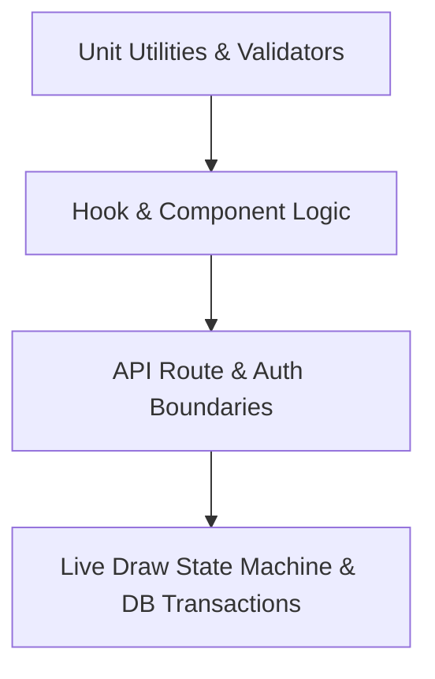

# Automated Test Baseline & Safety Net Plan

**Application:** Fashion Date (Sorteio Provador Fashion 2026)  
**Target:** Pre-Remediation Safety Harness  
**Deliverable Path:** [`docs/quality-audit/TEST_BASELINE_PLAN.md`](file:///c:/Users/thomas/OneDrive/Documentos/ChatGPT/Fashion%20Date/docs/quality-audit/TEST_BASELINE_PLAN.md)  
**Requirement:** All tests in this plan must be implemented **BEFORE** executing structural changes to authentication, database architecture, lucky number generation, or draw logic.

---

## 1. Objectives & Guiding Principles

1. **Protect Critical Business Invariants:** Prevent regressions in participant registration, duplicate prevention, lucky number integrity, and winner selection.
2. **Lock Security Boundaries:** Ensure authentication gates (`x-admin-key`, session storage, route guards) are verified by automated tests before refactoring.
3. **Safety for Refactoring:** Enable fearless database consolidation, schema migrations, and API contract realignment.
4. **Fast & Deterministic:** Tests must execute in < 5 seconds locally and in CI without flaky network dependencies.



---

## 2. Test Stack & Architecture

| Layer | Testing Tool / Framework | Purpose |
| :--- | :--- | :--- |
| **Unit & Integration Runner** | **Vitest** (`^3.0.0` or native Node test runner) | Blazing fast ESM execution compatible with Vite configuration |
| **DOM & Hook Testing** | `@testing-library/react` + `jsdom` | Test custom hooks and component behavior from user perspective |
| **Database Mocking / In-Memory** | Miniflare D1 / SQLite In-Memory (`better-sqlite3`) | Isolated database testing with realistic D1 batch and transaction behavior |
| **HTTP Request Simulation** | Native `Request` / `Response` (Fetch API) | Direct testing of Next.js Route Handlers without server spin-up |

---

## 3. Priority 1 (P1): Critical Business & Security Test Suites

### 3.1 Suite 1: Authentication & Authorization Boundaries
**Target File:** `tests/auth.test.ts`

| Test Case ID | Description | Invariant Verified |
| :--- | :--- | :--- |
| `AUTH-01` | Admin request with valid `x-admin-key` header | Returns status `200` and allows access |
| `AUTH-02` | Admin request with invalid `x-admin-key` header | Returns status `401 Unauthorized` |
| `AUTH-03` | Admin request with missing credentials | Returns status `401 Unauthorized` |
| `AUTH-04` | Environment variable precedence | Uses `env.ADMIN_PASSWORD` when injected; denies access on empty key |
| `AUTH-05` | `useAuth` hook login/logout lifecycle | Accurately syncs state with `localStorage`, `sessionStorage`, and dispatch events |

```typescript
// Example Test Structure: tests/auth.test.ts
import { describe, it, expect } from "vitest";
import { adminAllowed } from "@/app/api/_lib/db";

describe("Admin Authorization Guard", () => {
  it("rejects requests missing x-admin-key header", () => {
    const req = new Request("http://localhost/api/admin/participants");
    expect(adminAllowed(req)).toBe(false);
  });

  it("accepts requests with matching x-admin-key header", () => {
    const req = new Request("http://localhost/api/admin/participants", {
      headers: { "x-admin-key": "test-password-123" },
    });
    expect(adminAllowed(req)).toBe(true);
  });
});
```

---

### 3.2 Suite 2: Participant Registration & Duplicate Protection
**Target File:** `tests/participants.test.ts`

| Test Case ID | Description | Invariant Verified |
| :--- | :--- | :--- |
| `REG-01` | Valid participant submission | Creates record with status 201, returns participant object with lucky number |
| `REG-02` | Duplicate phone submission | Returns status 200, `duplicate: true`, and existing lucky number without creating new row |
| `REG-03` | Registration when closed (`registrations_open = false`) | Returns status `403 Forbidden` with descriptive error |
| `REG-04` | Validation failure (invalid phone < 10 digits) | Returns status `400 Bad Request` |
| `REG-05` | Validation failure (consent not checked) | Returns status `400 Bad Request` |
| `REG-06` | Public phone lookup (`GET /api/participants?phone=...`) | Returns participant data for valid number; returns 404 for unknown number |

---

### 3.3 Suite 3: Lucky Number Generation & Collision Avoidance
**Target File:** `tests/lucky-number.test.ts`

| Test Case ID | Description | Invariant Verified |
| :--- | :--- | :--- |
| `LUCK-01` | Format verification | Always produces a 4-digit zero-padded string between `"0001"` and `"9999"` |
| `LUCK-02` | Uniqueness guarantee | Enforces SQLite `UNIQUE` constraint on `lucky_number` column |
| `LUCK-03` | Collision retry mechanism | Successfully finds an available number even when simulated collisions occur |
| `LUCK-04` | High-concurrency simulation | 50 concurrent registrations produce 50 distinct lucky numbers without deadlocks |

---

### 3.4 Suite 4: Live Draw State Machine & Announcement Flow
**Target File:** `tests/live-draw.test.ts`

| Test Case ID | Description | Invariant Verified |
| :--- | :--- | :--- |
| `DRAW-01` | Sorteio execution (`POST /api/admin/draw`) | Selects an active participant, updates status to `winner`, records `won_at` timestamp |
| `DRAW-02` | Sorteio with zero active participants | Returns status `409 Conflict` with error message |
| `DRAW-03` | Winner exclusion from subsequent draws | A winner cannot be drawn twice; excluded from `ORDER BY RANDOM()` candidate pool |
| `DRAW-04` | Telão announcement publish (`PATCH /api/admin/draw`) | Updates `latest_draw_id` and `latest_winner_number` in settings |
| `DRAW-05` | Attendee live alert polling (`GET /api/live-draw`) | Returns latest draw ID and winner number for active clients |

---

## 4. Priority 2 (P2): Utility Functions & Custom Hooks Test Suites

### 4.1 Suite 5: Formatters & Validators Unit Tests
**Target File:** `tests/utils.test.ts`

```typescript
// Target coverage: 100% of utils/formatters.ts and utils/validators.ts
import { describe, it, expect } from "vitest";
import { formatPhone, cleanPhone, formatName, formatLuckyNumber, formatInstagram } from "@/utils/formatters";
import { isValidName, isValidPhone, isValidInstagram } from "@/utils/validators";

describe("Formatters & Validators", () => {
  it("formats Brazilian phone numbers with mask", () => {
    expect(formatPhone("11987654321")).toBe("(11) 98765-4321");
    expect(cleanPhone("(11) 98765-4321")).toBe("11987654321");
  });

  it("formats names with proper Unicode word capitalization", () => {
    expect(formatName("maria clara santos")).toBe("Maria Clara Santos");
  });

  it("formats lucky numbers with 4-digit padding", () => {
    expect(formatLuckyNumber(7)).toBe("0007");
    expect(formatLuckyNumber("142")).toBe("0142");
    expect(formatLuckyNumber(null)).toBe("----");
  });

  it("validates phone numbers strictly with DDD", () => {
    expect(isValidPhone("(11) 98765-4321")).toBe(true);
    expect(isValidPhone("12345")).toBe(false);
  });
});
```

---

### 4.2 Suite 6: Custom Hooks Tests
**Target File:** `tests/hooks.test.ts`

| Hook | Test Cases |
| :--- | :--- |
| `useSavedParticipant` | 1. Hydrates saved user from storage.<br>2. Saves participant to `localStorage` + `sessionStorage`.<br>3. Clears participant on reset.<br>4. Handles `lookupByPhone` successfully. |
| `useSlotMachine` | 1. Initial 4-digit state `["0","0","0","0"]`.<br>2. `triggerDraw` executes sequential reel locking.<br>3. Mute toggle updates state and audio synthesizer.<br>4. `resetDraw` clears winner and restores idle state. |
| `useLiveAlert` | 1. Activation triggers WakeLock and audio fanfare.<br>2. Detects matching lucky number and triggers `"winner"` celebration.<br>3. Detects non-matching number and triggers `"not-winner"` notification.<br>4. Silence alarm stops audio loop. |
| `useParticipants` | 1. Filters list by search query (name, store, phone, lucky number).<br>2. Filters list by status (`all`, `active`, `winner`).<br>3. Sorts by date, name, and lucky number.<br>4. Computes stats (`total`, `today`, `winners`). |

---

## 5. File Layout & Organization

```
tests/
├── rendered-html.test.mjs    # Existing SSR route tests (Preserved)
├── auth.test.ts              # P1: Admin security and token validation
├── participants.test.ts      # P1: Registration, duplicates, and validation
├── lucky-number.test.ts      # P1: 4-digit RNG, formatting, and collision avoidance
├── live-draw.test.ts         # P1: Draw state machine, winner exclusion, announcements
├── utils.test.ts             # P2: Formatters, validators, CSV export
└── hooks.test.ts             # P2: React custom hooks unit testing
```

---

## 6. Implementation & Execution Steps

### Step 1: Install Test Dependencies (Dev Only)
```bash
npm install -D vitest @testing-library/react @testing-library/jest-dom jsdom
```

### Step 2: Add Package Scripts to `package.json`
```json
{
  "scripts": {
    "test": "vitest run && npm run test:ssr",
    "test:unit": "vitest",
    "test:coverage": "vitest run --coverage",
    "test:ssr": "npm run build && node --test tests/rendered-html.test.mjs"
  }
}
```

### Step 3: Execution Order
1. Implement **`utils.test.ts`** and **`auth.test.ts`** first (establishes zero-dependency baseline).
2. Implement **`lucky-number.test.ts`** and **`participants.test.ts`**.
3. Implement **`live-draw.test.ts`** and **`hooks.test.ts`**.
4. Run full test suite:
   ```bash
   npm test
   ```
5. Proceed to production refactoring **only after all P1 and P2 tests pass with green exit code (0)**.

---

*Plan approved for pre-remediation safety enforcement.*
